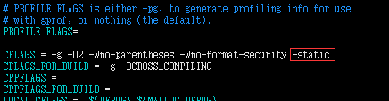
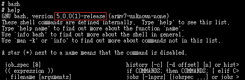

# Prerequisite

a. need a host operating system  
b. need to setup the cross compiling environment  

	For a, I select my favourite Ubuntu 16.04.4 LTS
	
	For b, the detail process is not covered by this document, but I believe you can find the answer from the website of your cross-compiler. And for user friendly OS as Ubuntu, you can install the cross-compiler by "apt install"
	
# Steps to cross compile static bash
a. obtain the latest bash source codes  
\# wget http://ftp.gnu.org/gnu/bash/bash-5.0.tar.gz
\# tar -xzvf bash-5.0.tar.gz  
\# cd bash-5.0

b. add the cross-compiler path to PATH  
\# export PATH=/opt/gcc-linaro-6.3.1-2017.02-x86_64_arm-linux-gnueabihf/bin:$PATH

c. execute configue to generate Makefile  
\# ./configure CC=arm-linux-gnueabihf-gcc --host=armv7 --build=x86_64 --enable-static-link --enable-history --without-bash-malloc

d. modify the generated Makefile to make it static compiling  

e. make  
\# make

	After the above steps, you'll have a staticly cross-compiled bash binary, and make sure "file bash" tells you it is a statically linked one

# Verification
a. copy binary bash to target board as below  

b. run  

