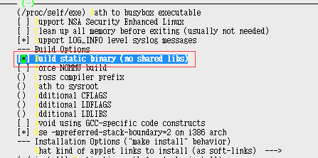
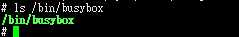
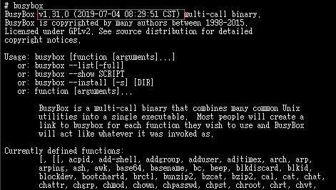

# Prerequisite

a. need a host operating system  
b. need to setup the cross compiling environment  

	For a, I select my favourite Ubuntu 16.04.4 LTS
	
	For b, the detail process is not covered by this document, but I believe you can find the answer from the website of your cross-compiler. And for user friendly OS as Ubuntu, you can install the cross-compiler by "apt install"
	
# Steps to cross compile static busybox
a. obtain the latest busybox source codes
\# wget https://busybox.net/downloads/busybox-1.31.0.tar.bz2  
\# tar -jxvf busybox-1.31.0.tar.bz2  
\# cd busybox-1.31.0

b. do the necessary configuration so that busybox can be built staticly  
\# make defconfig  
\# make menuconfig

	Select Settings->Buid Options->Build static binary(no shared libs)

c. make
\# make CROSS_COMPILE=/opt/gcc-linaro-6.3.1-2017.02-x86_64_arm-linux-gnueabihf/bin/arm-linux-gnueabihf-

	After the above steps, you'll have a staticly cross-compiled busybox binary, and make sure "file busybox" tells you it is a statically linked one

# Verification
a. copy binary busybox to target board as below  

b. run  

