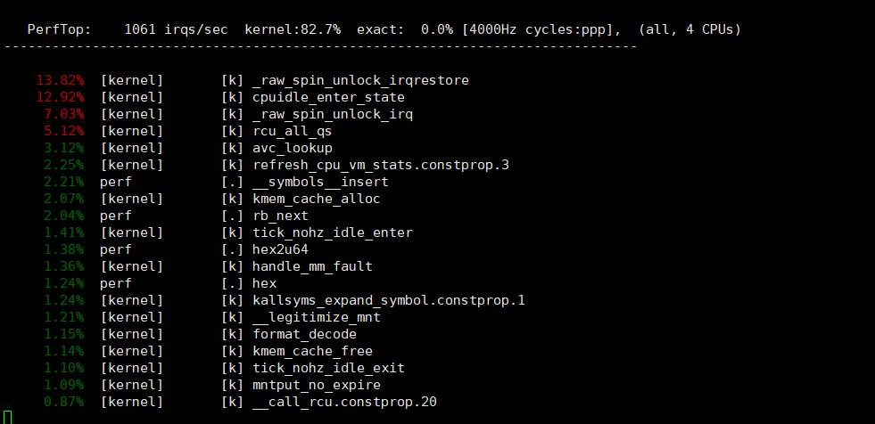

# Prerequisite

a. need a host operating system

b. need to setup the cross compiling environment

c. zlib && elfutil

```
For a, I recommend my newly installed Ubuntu 20.04 LTS

For b, the detail process is not covered by this document, but I believe you can find the answer from the website of your cross-compiler. And for user friendly OS as Ubuntu, you can install the cross-compiler by "apt install"

For c, zlib-1.2.11 && elfutils-0.170 are selected
```


# Steps to install zlib && elfutils

\# export CC=/opt/gcc-linaro-6.3.1-2017.02-x86_64_arm-linux-gnueabihf/bin/arm-linux-gnueabihf-gcc

\# cd zlib-1.2.11

\# ./configure --prefix=/opt/gcc-linaro-6.3.1-2017.02-x86_64_arm-linux-gnueabihf/arm-linux-gnueabihf/libc/usr/

\# make

\# make install

\# cd elfutils-0.170

\# ./configure --host=arm-linux-gnueabihf --prefix=/opt/gcc-linaro-6.3.1-2017.02-x86_64_arm-linux-gnueabihf/arm-linux-gnueabihf/libc/usr/

overwrite Makefile && backends/Makefile with patches/elfutils/Makefile &&  patches/elfutils/backends_Makefile

\# make

\# make install

# Steps to cross compile static perf

\# cd linux-kernel-4.9.x

apply patches/perf/1.patch && apply patches/perf/2.patch

\# cd tools/perf

\# make LDFLAGS=-static ARCH=arm CROSS_COMPILE=/opt/gcc-linaro-6.3.1-2017.02-x86_64_arm-linux-gnueabihf/bin/arm-linux-gnueabihf- DEBUG=1 HAVE_CPLUS_DEMANGLE=1 

LIBDW_DIR=/opt/gcc-linaro-6.3.1-2017.02-x86_64_arm-linux-gnueabihf/arm-linux-gnueabihf/libc/usr/ 

The we can find the static cross compiled perf right at tools/perf dir

<div align="center"></div>

<p align="center">P1. static perf info</p>

# Verification
\# ./tmp/perf top 
<div align="center"></div>
<p align="center">P2. run perf perf</p>