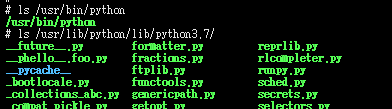
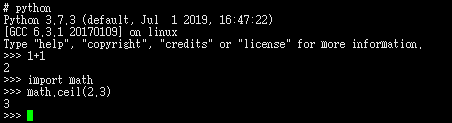

# Prerequisite

a. need a host operating system 
b. need to setup the cross compiling environment 
c. python with the same version should be install on the host OS

	For a, I select my favourite Ubuntu 16.04.4 LTS
	For b, the detail process is not covered by this document, but I believe
you can find the answer from the website of your cross-compiler. And for user
friendly OS as Ubuntu, you can install the cross-compiler by "apt install"
	For c, you can install it via source code or a pre-built one

# Steps to cross compile static python
a. obtain the latest Python source code 
\# wget https://www.python.org/ftp/python/3.7.3/Python-3.7.3.tgz 
\# tar -zxvf Python-3.7.3.tgz 
\# cd Python-3.7.3 

b. add the cross-compiler path to PATH 
\# export PATH=/opt/gcc-linaro-6.3.1-2017.02-x86_64_arm-linux-gnueabihf/bin:$PATH

c. do the necessary setting before configure 
\# echo ac_cv_file__dev_ptmx=no > config.site 
\# echo ac_cv_file__dev_ptc=no >> config.site 
\# export CONFIG_SITE=config.site 
	If you wanna build math lib into python 
\# echo "math mathmodule.c _math.c # -lm # math library functions, e.g. sin()" >> Modules/Setup.local

d. execute configue to generate Makefile 
\# ./configure LDFLAGS="-static" --disable-shared CC=arm-linux-gnueabihf-gcc CXX=arm-linux-gnueabihf-g++ AR=arm-linux-gnueabihf-gcc-ar RANLIB=arm-linux-gnueabihf-ranlib --host=arm-linux-gnueabihf --build=armv7 --disable-ipv6

d. make 
\# make python LDFLAGS="-static" LINKFORSHARED=" "

	After the above steps, you'll have a staticly cross-compiled python binary,\
and make sure "file python" tells you it is a statically linked one

# Verification
a. copy binary python and fold Lib(rename it to python3.7) to target board as below 

b. setup PYTHONHOME 
\# export PYTHONHOME=/usr/lib/python/

c. run 

